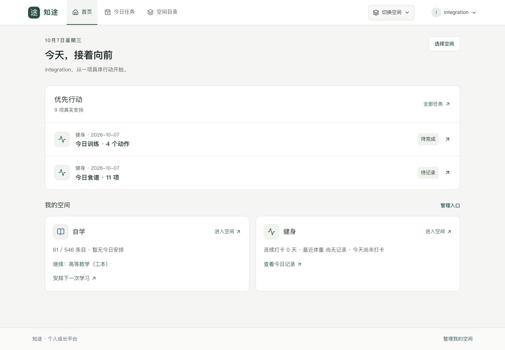
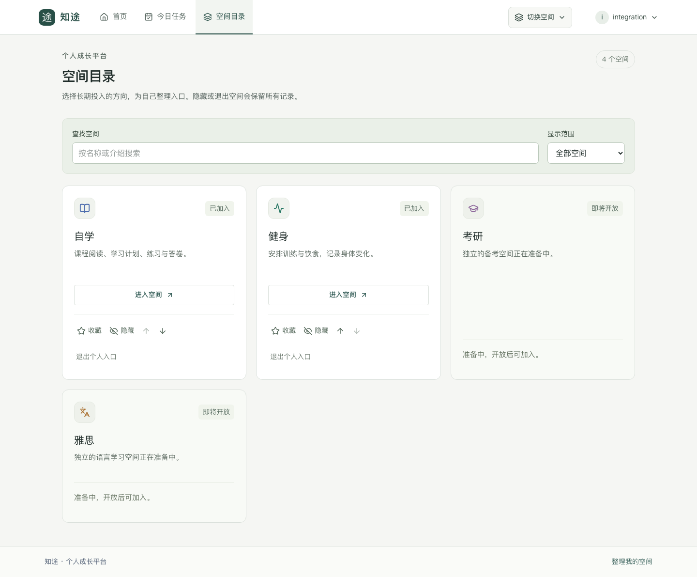
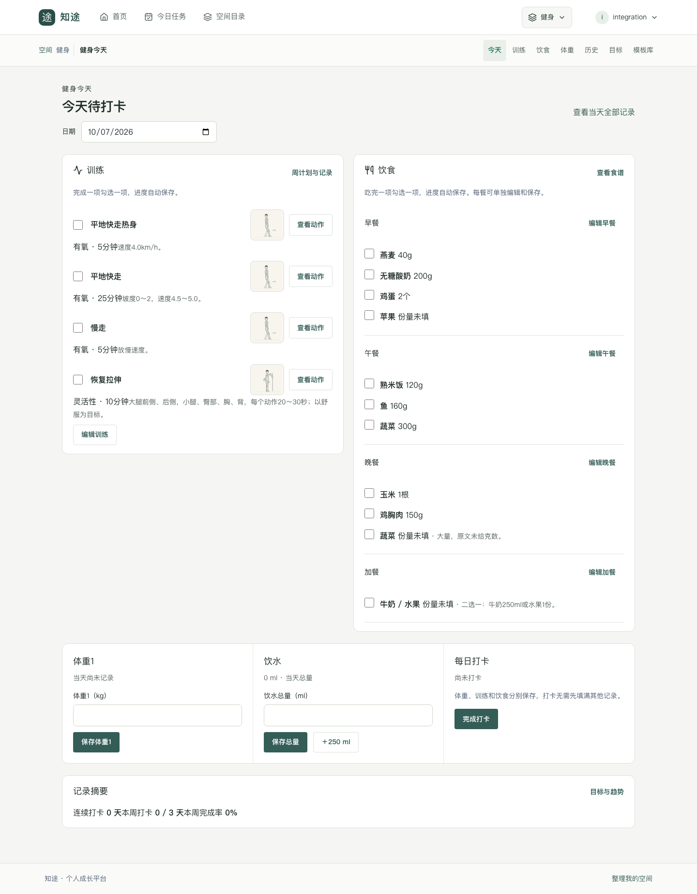
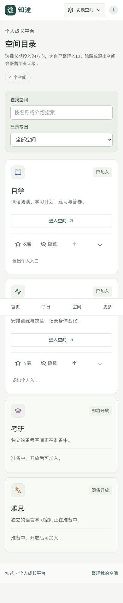

# 主要页面截图

截图来自本地真实页面和已授权账号，2026-10-07。完整证据目录另有768px版本、训练计划编辑、课程与题库管理，以及明确标注的2/6/12空间测试配置。

| 页面 | 桌面1440px | 手机390px |
|---|---|---|
| 个人首页 | [首页](evidence/home-1440.png) | [首页](evidence/home-390.png) |
| 空间目录 | [目录](evidence/spaces-1440.png) | [目录](evidence/spaces-390.png) |
| 跨空间今日任务 | [今日任务](evidence/today-1440.png) | [今日任务](evidence/today-390.png) |
| 自学今日 | [学习](evidence/study-1440.png) | [学习](evidence/study-390.png) |
| 健身今天 | [健身](evidence/fitness-1440.png) | [健身](evidence/fitness-390.png) |
| 管理工作台 | [管理](evidence/admin-1440.png) | [管理](evidence/admin-390.png) |
| 课程目录 | [课程](evidence/-study-course-00023-catalog-1440.png) | [课程](evidence/-study-course-00023-catalog-390.png) |
| 题库作答入口 | [题库](evidence/-study-course-00023-practice-1440.png) | [题库](evidence/-study-course-00023-practice-390.png) |
| 真题与批改入口 | [真题](evidence/-study-course-00023-exams-1440.png) | [真题](evidence/-study-course-00023-exams-390.png) |

[真实长文阅读](evidence/reading-1440.png) · [练习](evidence/practice-1440.png) · [真题与成绩](evidence/exams-grading-1440.png)

## 个人首页

## 空间目录

## 健身今天

## 手机入口

